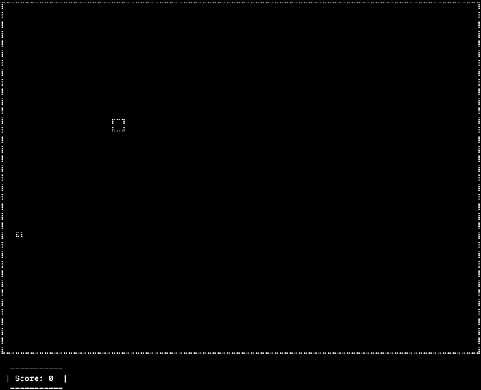

# Boxes



## To play the game

#### 1. Install the packgage

```
npm install kanyas-boxes
```

#### 2. Create `index.js` file

```
touch index.js
```

#### 3. Open the file

```
open index.js
```

#### 4. Write the code below in `index.js`

```js
var boxes = require('kanyas-boxes');

boxes();
```

#### 5. Start the game

```
node index.js
```

## How to quit the game 

press `0` (the 'ctrl + c' won't work in this case)